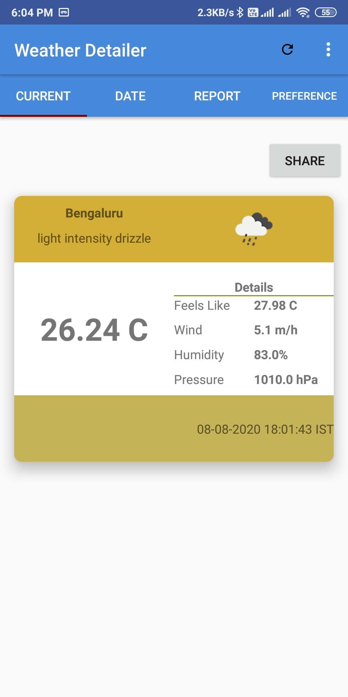
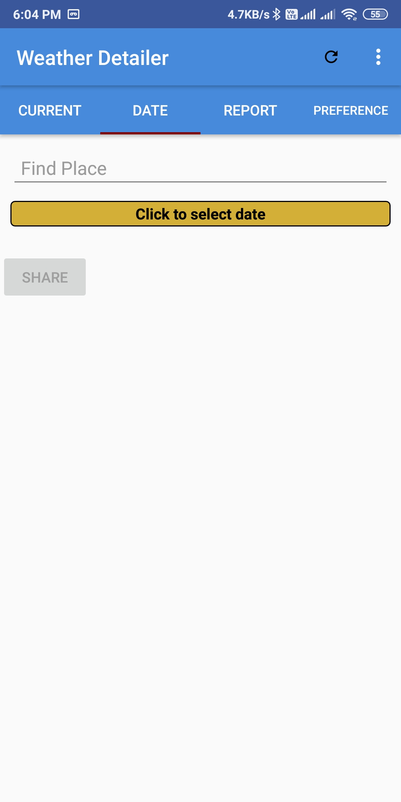
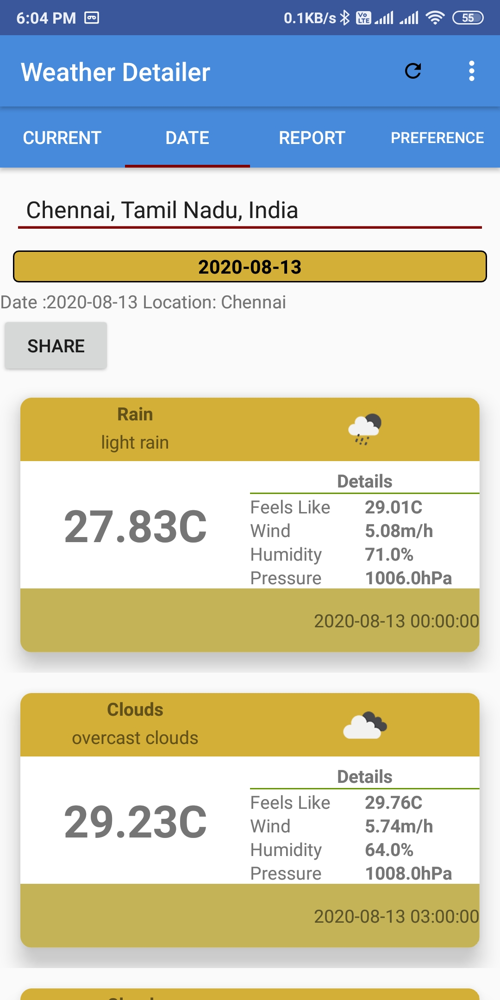
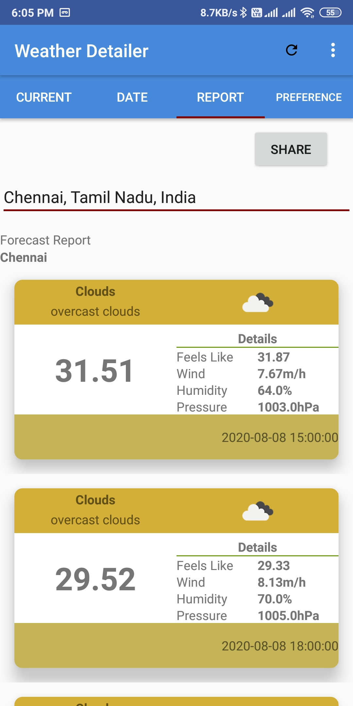
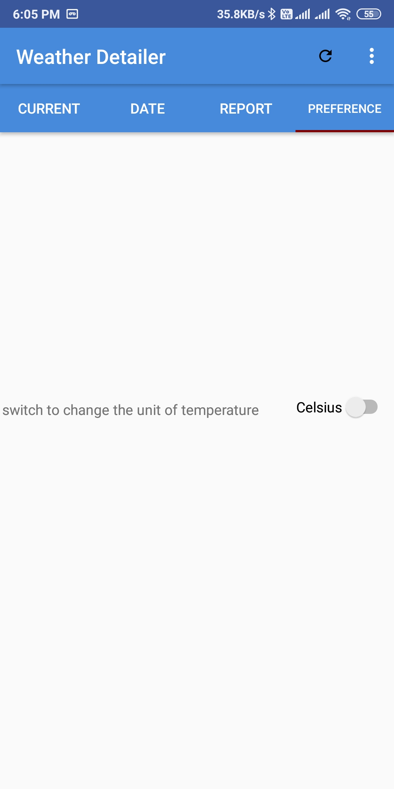

# weatherReporter
This app is used to  
* find current weather condition of your current location
* find weather forcast for naext 5 days of your current location
* find current weather of any cities
* find past weather report for lat 5 days of  any cities
* find weather forecast for next 5 days of any cities
* share the weather report to any other apps.

